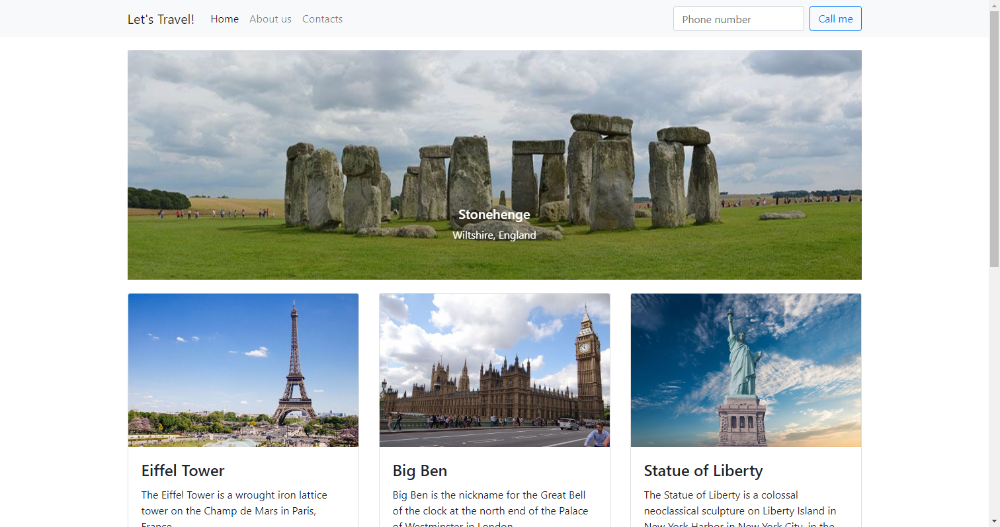

# Let's Travel Website

> This was a quick project to practice HTML/CSS and Bootstrap.

---

### Table of Contents
You're sections headers will be used to reference location of destination.

- [Description](#description)
- [How To Use](#how-to-use)
- [References](#references)
- [License](#license)
- [Author Info](#author-info)

---

## Description

Simple travel website showcasing sites someone might want to visit such as Stonehenge, Eiffel Tower, etc. It includes a "Contact" form at the bottom that shows modal and is only a design to show would could be done but it doesn't actually send a message. 

#### Technologies

- HTML
- CSS
- Bootstrap

[Back To TOC](#table-of-contents)

---

## How To Use
none

#### Installation
none

#### API Reference
none

[Back To TOC](#table-of-contents)

---

## References

[Back To TOC](#table-of-contents)

Bootstrap
---

## License

MIT License

Copyright (c) [2020] [Bryan Lundeen]

Permission is hereby granted, free of charge, to any person obtaining a copy
of this software and associated documentation files (the "Software"), to deal
in the Software without restriction, including without limitation the rights
to use, copy, modify, merge, publish, distribute, sublicense, and/or sell
copies of the Software, and to permit persons to whom the Software is
furnished to do so, subject to the following conditions:

The above copyright notice and this permission notice shall be included in all
copies or substantial portions of the Software.

THE SOFTWARE IS PROVIDED "AS IS", WITHOUT WARRANTY OF ANY KIND, EXPRESS OR
IMPLIED, INCLUDING BUT NOT LIMITED TO THE WARRANTIES OF MERCHANTABILITY,
FITNESS FOR A PARTICULAR PURPOSE AND NONINFRINGEMENT. IN NO EVENT SHALL THE
AUTHORS OR COPYRIGHT HOLDERS BE LIABLE FOR ANY CLAIM, DAMAGES OR OTHER
LIABILITY, WHETHER IN AN ACTION OF CONTRACT, TORT OR OTHERWISE, ARISING FROM,
OUT OF OR IN CONNECTION WITH THE SOFTWARE OR THE USE OR OTHER DEALINGS IN THE
SOFTWARE.

[Back To TOC](#table-of-contents)

---

## Author Info

---

[Back To TOC](#table-of-contents)
